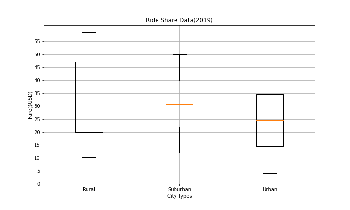
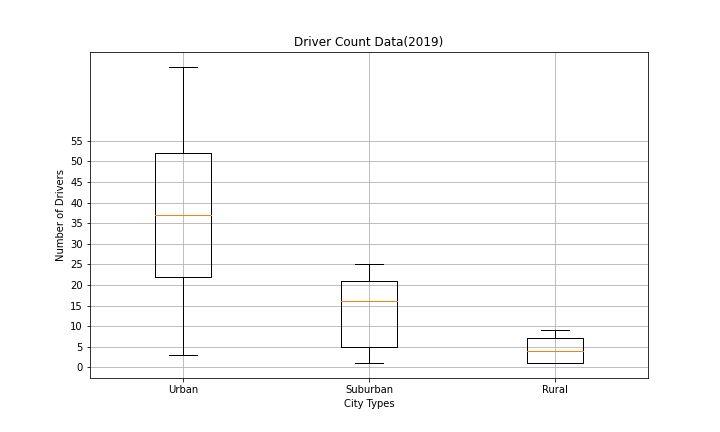
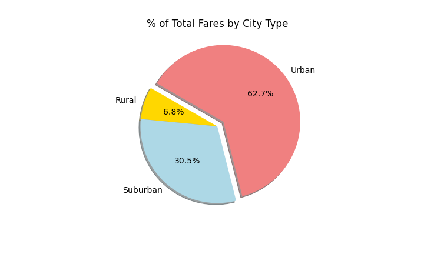
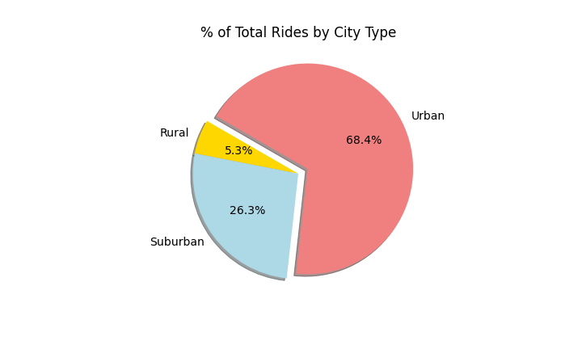
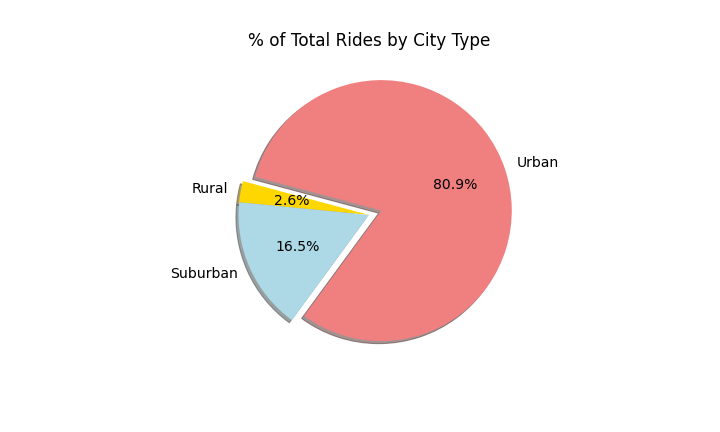
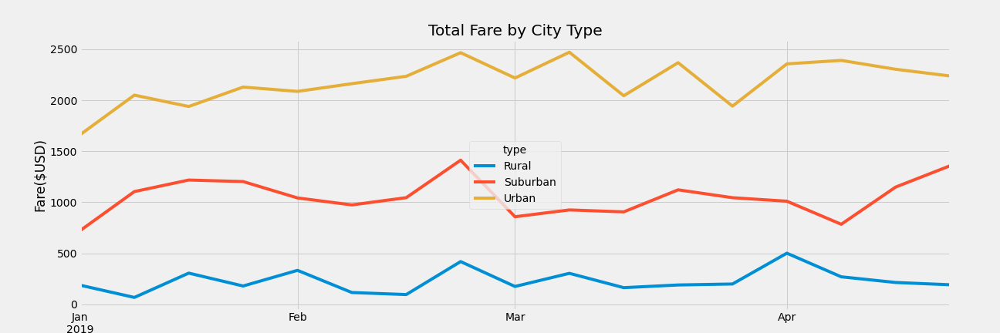

# Project Overview

Analyze data to compare the relationships between type of city, number of drivers and riders, and fares. The goal is to provide analysis and visualizations to assist PyBer in improving access and affordability to underserved neighborhoods.

## Resources

[PyBer_Challenge.ipynb](PyBer_Challenge.ipynb)

[Matplotlib.pyplot.plot - documentation](https://matplotlib.org/stable/api/_as_gen/matplotlib.pyplot.plot.html)

# Results

### Average Fare per Rides
As seen in the scatter plot, rural cities have fewer drivers yet larger average fares in comparison to other city types. In contrast, urban cities have more drivers and a smaller average fare. The suppply of drivers impact the average fare price.

### Number Rides per City Type
Here we show that urban cities have the highest rider count, suburban second, and rural the lowest rider count. The Box-and-Whisker plot also shows that there in an outlier in the urban city type of 39. This data confirms what the previous plot demonstrated; that urban cities have more drivers than other city types. 

### Fare Amount by City Type
Fares are on average higher in rural areas, but the minimum for rural areas is still almost as low as the urban. The standard deviation is slightly higher for rural than suburban, while suburban standard deviation is slightly higher than urban.

### Driver Count by City Type
The drivers are confirmed to be much more common in higher density cities for PyBer.

### % of Fares and Rides by City Type
**Notice anything about this pie chart? These charts look almost identical. There is a strong relationship between rides and fares.**

### Total Fares by City Type - Resampled
Another visualization showing that 80.9% of total drivers drive in urban cities. 

In this image we show the total fare for each week by city type from January through April. It is evident that there are peaks (last week in February and middle of March) while there are also dips (Beginning of March, early April). The total fare is considerably higher in urban cities than the other two. 

# Summary

## Recommendations
First, connecting with underserved markets through high traffic areas. If a rural area has heavy traffic at a brunch spot after church, then reach out to the church or restaurant to help visibility. This can always work with local bars or pubs, equally.

Second, incentive programs to increase driver count in rural areas. For example, for every ten rides a driver
