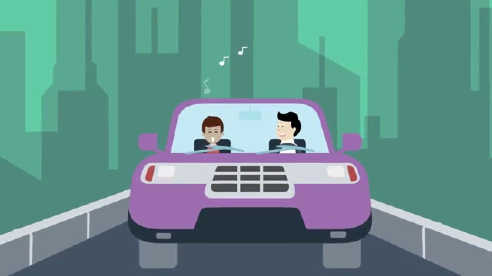
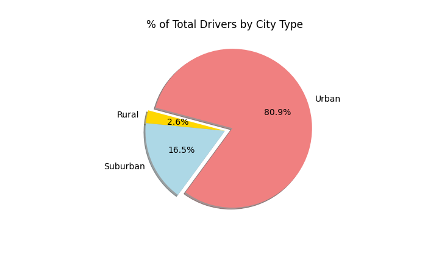

# PyBer Analysis

# Project Overview

Analyze data to compare the relationships between type of city, number of drivers and riders, and fares. The goal is to provide analysis and visualizations to assist PyBer in improving access and affordability to underserved neighborhoods. 

## Resources

[PyBer_Challenge.ipynb](PyBer_Challenge.ipynb)

[Matplotlib.pyplot.plot - documentation](https://matplotlib.org/stable/api/_as_gen/matplotlib.pyplot.plot.html)

## Code 

An example of code for deliverable 1.  DataFrame summary.

    #6. Create a PyBer summary DataFrame. 
    pyber_summary_df = pd.DataFrame(
        {"Total Rides": total_riders_count,
         "Total Drivers": total_driver_count,
         "Total Fares": total_fare,
         "Average Fare per Ride": avg_fare_ride,
         "Average Fare per Driver": avg_fare_driver}) 

### PyBer Summary

Plotting the resampled DataFrame for Fare by City Type with weekly representation. *See Figure 8*

    # 8. Using the object-oriented interface method, plot the resample DataFrame using the df.plot() function. 
    # Import the style from Matplotlib.
    from matplotlib import style
    # Use the graph style fivethirtyeight.
    plt.style.use('fivethirtyeight')
    date_range_week.plot(figsize=(18, 6))

    plt.title("Total Fare by City Type")
    plt.ylabel("Fare($USD)")
    plt.xlabel("Month")
    plt.savefig("analysis/Fig8.png")
    plt.show()

# Results

### (Fig. 1) Average Fare per Rides
As seen in the scatter plot, rural cities have fewer drivers yet larger average fares in comparison to other city types. In contrast, urban cities have more drivers and a smaller average fare. The suppply of drivers impact the average fare price.

### (Fig. 2) Number Rides per City Type
Here we show that urban cities have the highest rider count, suburban second, and rural the lowest rider count. The Box-and-Whisker plot also shows that there in an outlier in the urban city type of 39. This data confirms what the previous plot demonstrated; that urban cities have more drivers than other city types. 

### (Fig. 3) Fare Amount by City Type
Fares are on average higher in rural areas, but the minimum for rural areas is still almost as low as the urban. The standard deviation is slightly higher for rural than suburban, while suburban standard deviation is slightly higher than urban.

### (Fig. 4) Driver Count by City Type
The drivers are confirmed to be much more common in higher density cities for PyBer. The sheer low driver count in rural areas bring up the cost of fare.

### (Fig. 5, 6) % of Fares and Rides by City Type
**Notice anything about this pie chart? These charts look almost identical. There is a strong relationship between ride and fare %.**

### (Fig. 7) Percent of Total Drivers by City Type
A visualization showing that 80.9% of total drivers drive in urban cities. It's clear that more of the workforce being in urban areas comtribute to the extra drivers.

### (Fig. 8) Total Fares by City Type - Resampled

In this image we show the total fare for each week by city type from January through April. It is evident that there are peaks (last week in February and middle of March) while there are also dips (Beginning of March, early April). The total fare is considerably higher in urban cities than the other two. 

# Summary

## Recommendations
First, connecting with underserved markets through high traffic areas. If a rural area has heavy traffic at a brunch spot after church, then reach out to the church or restaurant to help visibility. This can always work with local bars or pubs, equally.

Second, incentive programs to increase driver count in rural (and even suburban) areas. For example, for every ten rides a PyBer driver completes, a $20 bonus is earned. This could be a temporary promotion to "jumpstart" the PyBer driverbase in underserved communities.

Lastly, a way to increase drivers in the underserved areas is to advertise and share the benefits of schedule flexibility and independence. This wouldn't be an expensive campaign as it would be specific to drivers in a hyper-focused area within a specific age demographic (old enough to drive).
